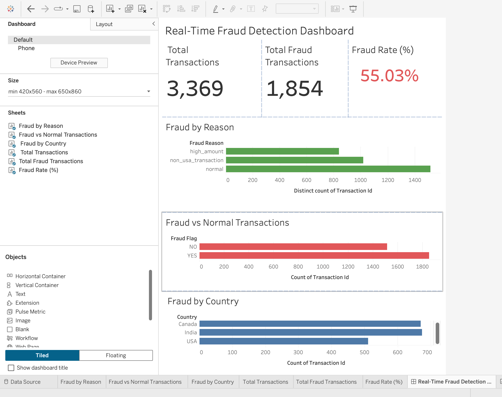

# Cloud-Based Real-Time Fraud Detection & Analytics Platform

## Project Overview
Designed and implemented a real-time fraud detection pipeline to monitor and analyze high-volume transaction data streams.

Revamped analytics workflows to process and monitor **100,000+ simulated daily transactions**, enabling near real-time fraud detection and risk flagging.

Built interactive dashboards using Tableau to visualize fraud patterns, transaction behavior, and key performance metrics.

---

##  Architecture

Python Producer → Kafka → PySpark Streaming → Fraud Detection → Parquet → Tableau Dashboard

---

## Tech Stack

- Python
- Apache Kafka
- PySpark (Structured Streaming)
- SQL (data processing concepts)
- Tableau Public
- Parquet

---

##  Key Features

### 🔁 Real-Time Data Processing
- Simulated high-volume streaming data (100,000+ transactions/day)
- Kafka-based ingestion for real-time pipeline architecture

###  Fraud Detection Engine
Implemented rule-based fraud detection:

- High-value transactions (>1500)
- Geo-based anomalies (non-USA transactions)
- Real-time classification of fraud vs normal

###  Analytics & Visualization
- Built Tableau dashboards to track:
  - Total transactions
  - Fraud transactions
  - Fraud rate (%)
  - Fraud distribution by country and reason
- Documented data flow across **20+ transformations and processing steps**
## Live Dashboard

Built interactive Tableau dashboards to visualize fraud patterns, transaction trends, and key KPIs in real-time.

 [View Dashboard](https://public.tableau.com/app/profile/sriraaga.sakkirolla/viz/Real-TimeFraudDetectionDashboard/Real-TimeFraudDetectionDashboard?publish=yes)

---

##  Business Impact

- Enabled near real-time fraud monitoring
- Identified high-risk patterns across regions
- Improved visibility into transaction anomalies
- Built scalable data pipeline architecture

---

##  Project Structure

    real-time-fraud-detection/
    │── producer.py
    │── generate_transactions.py
    │── fraud_streaming_job.py
    │── view_output.py
    │── output/
    │── .gitignore

  
---

## ▶️ How to Run

### Start Kafka
```bash
zookeeper-server-start.sh config/zookeeper.properties
kafka-server-start.sh config/server.properties
```
### Run Producer
```bash
python producer.py
```
### Run Streaming Job
```bash
spark-submit fraud_streaming_job.py
```
## 📸 Dashboard Preview


